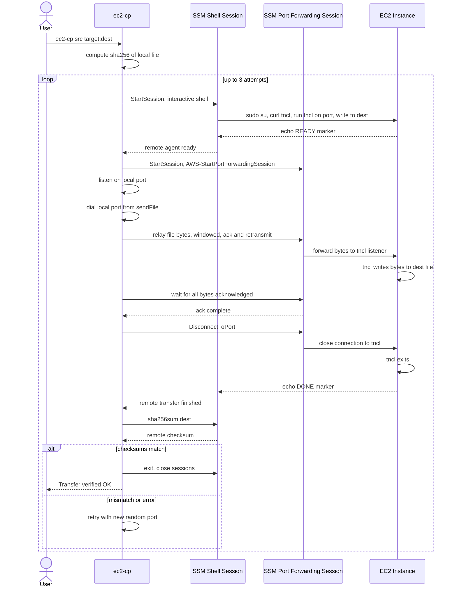

# ec2-cp

A file copy command for EC2. It works via SSM without SSH.

## Usage

```
$ ec2-cp <src> <dest>
```

## Example

```sh
$ ec2-cp /path/to/local/file i-012345678901abcdef:/path/to/remote/file
```

## Required IAM Policy

* `AmazonSSMManagedInstanceCore`

## How It Works

`ec2-cp` doesn't use SCP or SFTP. Instead it opens two independent SSM sessions and bridges a local TCP file transfer through them, then verifies the result with a SHA-256 checksum on both ends:

1. Compute the local file's SHA-256 checksum.
2. Start an SSM shell session and have it download and run [tncl](https://github.com/fujiwara/tncl) (a small netcat-like tool) on the instance, listening on a random port and writing whatever it receives to the destination file.
3. Start a second SSM session using the `AWS-StartPortForwardingSession` document, forwarding a local TCP port to that same port on the instance.
4. Open a local TCP connection to the forwarded port and stream the file into it. A custom reliability layer chunks the data, waits for acknowledgements, and retransmits as needed, since the SSM service silently drops oversized or unacknowledged messages.
5. Once every byte is acknowledged, disconnect the forwarded port so `tncl` sees EOF and exits, then run `sha256sum` on the instance (over the shell session) and compare it against the local checksum.
6. If the checksums don't match (or something failed along the way), retry the whole process, up to 3 attempts.



## Limitations

* tool limitations
  * Copying files from EC2 is not supported
  * Sessions may sometimes remain
* EC2 limitations
  * `ssm-user` needs to be able to become `root`
  * `x86_64` and `arm64` only support
  * Internet access is needed

## Credits

* This program is inspired by [fujiwara/ecsta](https://github.com/fujiwara/ecsta/)
* `port_forwarding.go` is based [mmmorris1975/ssm-session-client](https://github.com/mmmorris1975/ssm-session-client/)
